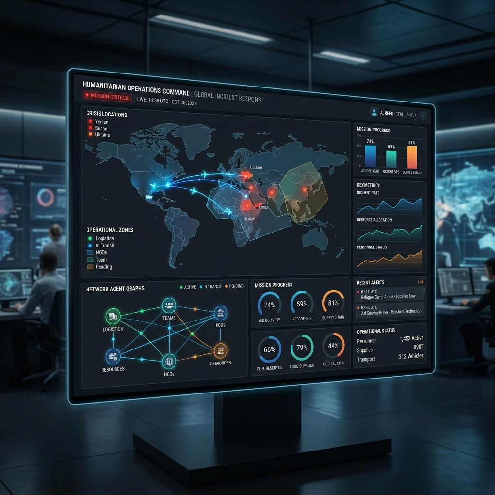
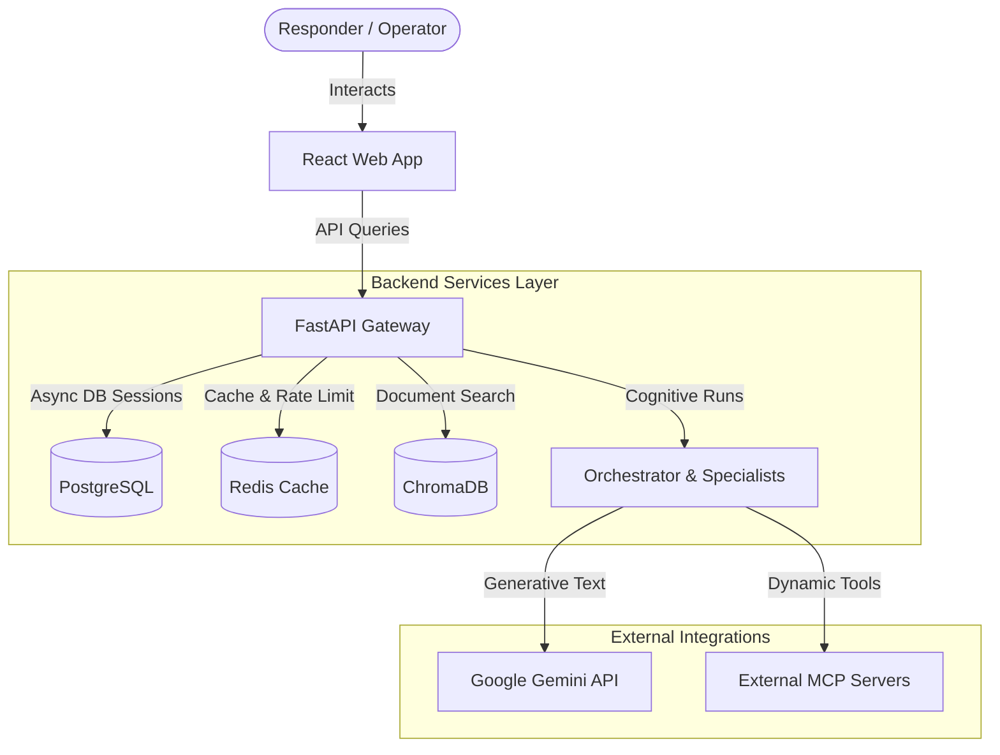
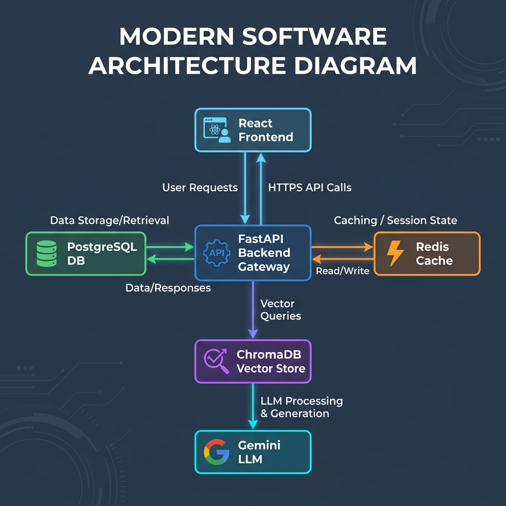
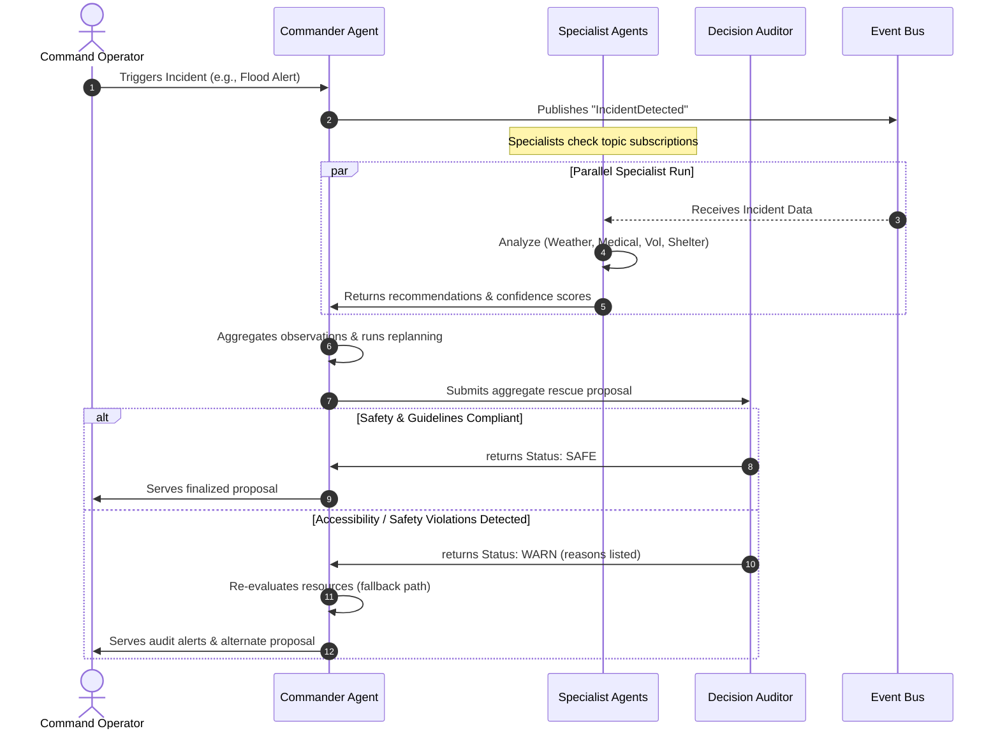
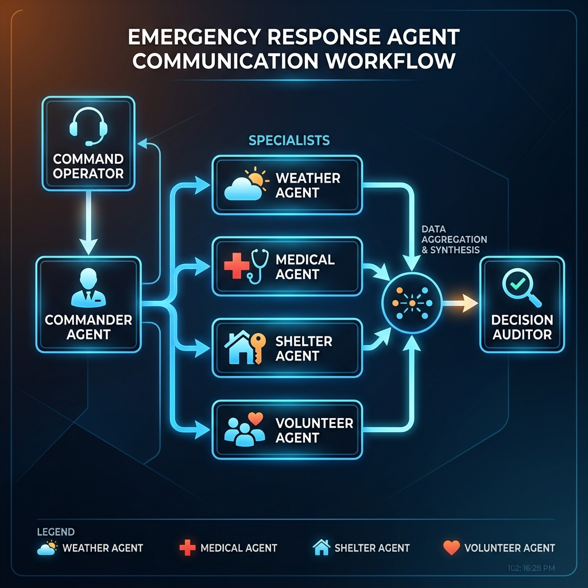
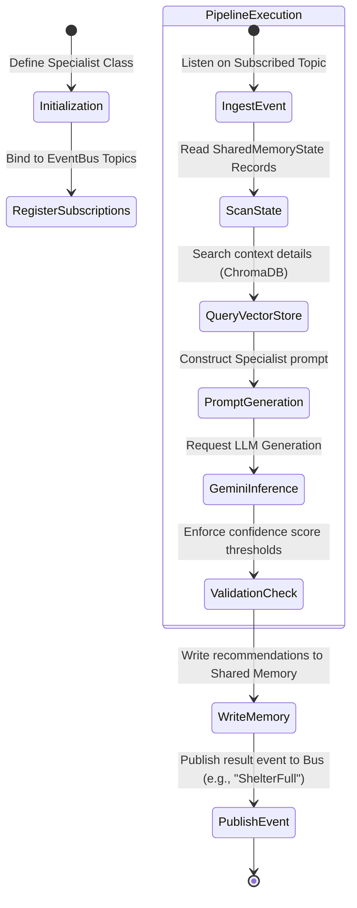
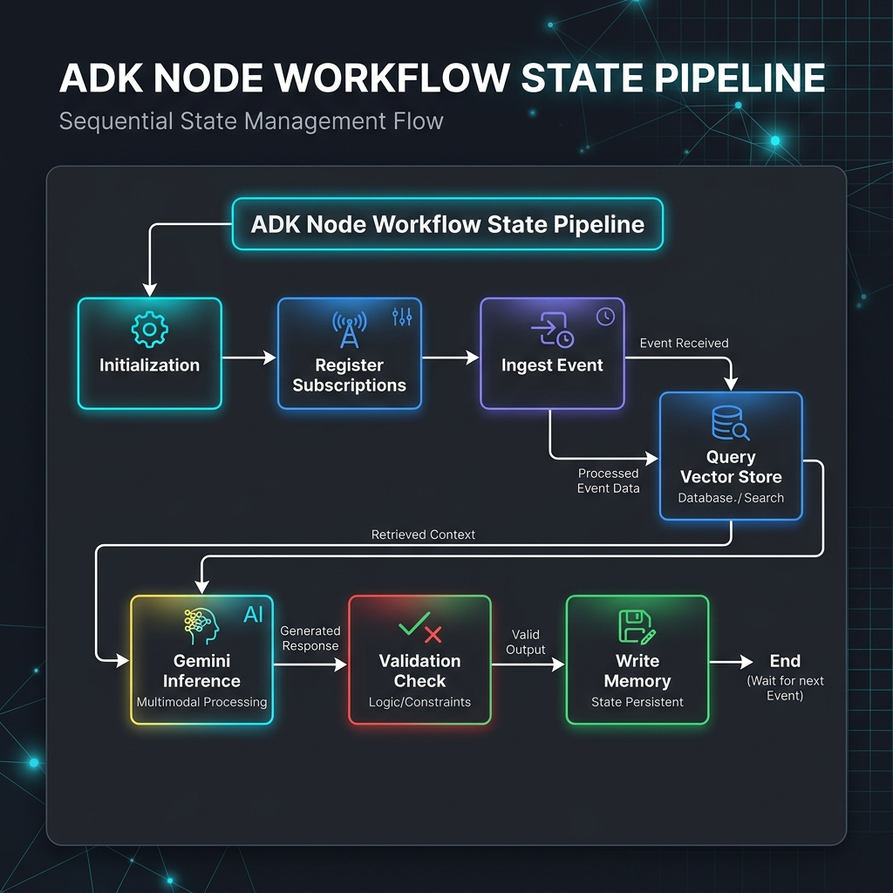
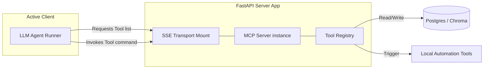
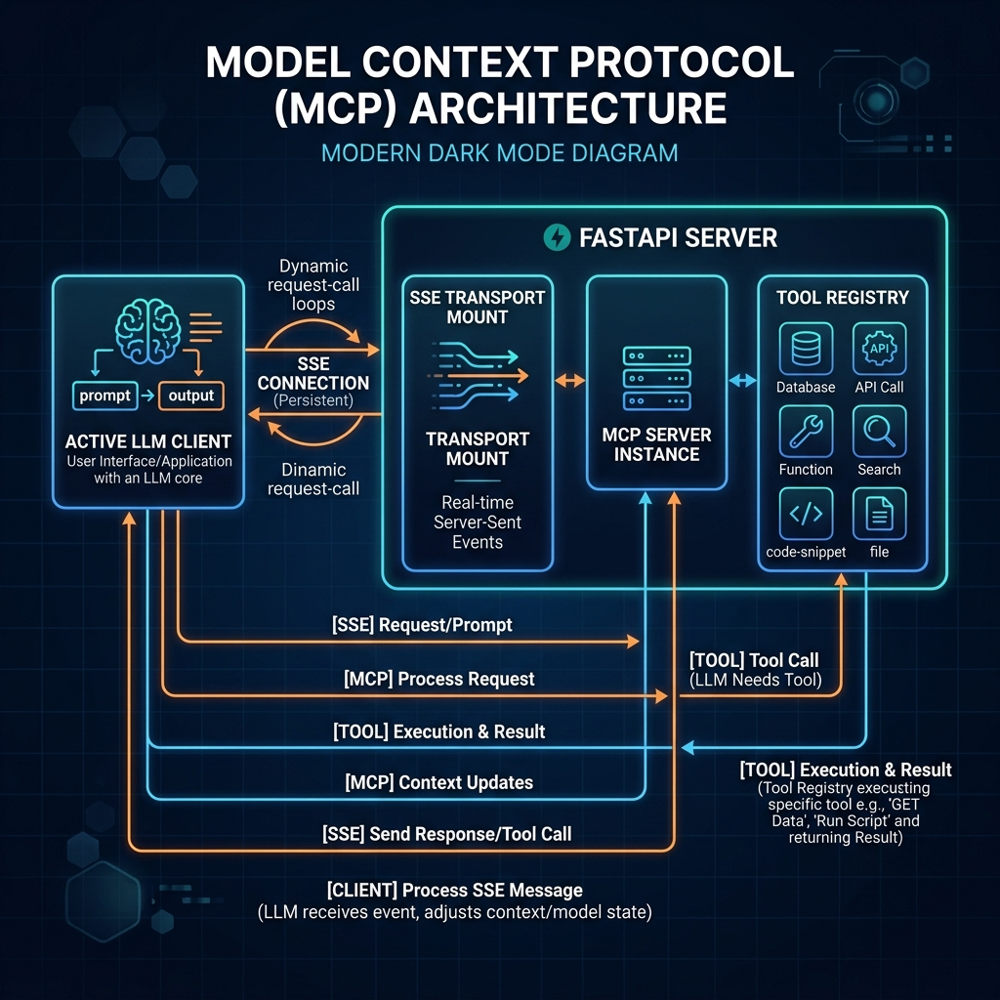

# HumanityOS: Humanitarian Operations Command Center

HumanityOS is a next-generation, production-ready Command Center platform designed to orchestrate cognitive AI agents, parse spatial disaster maps, simulate crises, and authorize responders during humanitarian relief operations.



## Core Capabilities
* **Interactive Disaster Map**: Rich geographic rendering of emergency zones, hospital availability, shelter capacity, and real-time responder coordinates.
* **Agent Execution Graph**: A visual canvas powered by **React Flow** demonstrating the live status, communication flows, and confidence scores of 11 AI specialist agents.
* **Disaster Simulation Engine**: Real-time simulation of five complex crisis scenarios (Cyclone, Flood, Earthquake, Wildfire, Heatwave) triggering cascades of emergency updates.
* **Granular Security (RBAC & Auth)**: Strict Firebase Authentication with 5 user roles (Administrator, Responder, Volunteer, NGO, Citizen) protecting agent execution and rate limits.
* **Cognitive Decision Auditor**: Security-bound auditing system ensuring disaster proposals comply with safety bounds and accessibility guidelines.

---

## 🏗️ Architecture & System Diagrams

Below are the key architectural diagrams mapping the data flows, agent pipelines, and protocols within HumanityOS.

### 1. Central Component Topology (Core Architecture)
Maps the relationship between the React client, FastAPI gateway, caches, databases, and LLM providers.





---

### 2. Cognitive Agent Interaction (Sequence Diagram)
Shows the sequential and parallel message passing over the global `EventBus` and `SharedMemory` interface.





---

### 3. ADK Model & Workflow (State Diagram)
Demonstrates how the Agent Development Kit (ADK) guides specialist node execution, event loops, and memory logging.





---

### 4. Model Context Protocol (MCP) Integration
Maps how external LLM clients fetch tools from the FastAPI Server using Server-Sent Events (SSE).





---


## Technical Documentation Portal

Browse the technical guides to set up, operate, deploy, and present the HumanityOS platform:

### 1. Development & Setup Guides
* 💻 **[Local Installation Guide](docs/installation_guide.md)**: Setup PostgreSQL, Redis, ChromaDB, FastAPI dependencies, and the React Vite client on your local machine.
* 📦 **[Deployment Guide](docs/deployment_guide.md)**: Containerize the app and deploy the backend to **Google Cloud Run** and the frontend to **Firebase Hosting** using automatic GitHub Actions CI/CD workflows.

### 2. Architecture & Design Specifications
* 🏗️ **[System Architecture & Workflows](docs/architecture_documentation.md)**: Conceptual layout of the cognitive agent hierarchy, Model Context Protocol (MCP) server integration, and ADK model declaration workflows.
* 🗄️ **[Database Schema Layout](docs/database_schema.md)**: Specifications for PostgreSQL relational schemas, Alembic migrations, Chroma vector collections, and Redis key structures.
* 🔌 **[API Documentation](docs/api_documentation.md)**: Path specifications, request validation models, response payloads, role access mappings, and rate limits.

### 3. Verification, Demos & Presentation
* 🎤 **[Hackathon Presentation & Demo Script](docs/demo_script.md)**: A complete 5-minute demo walkthrough, slide deck outline, and script operators prompts for pitching.
* 🔧 **[Troubleshooting Guide](docs/troubleshooting_guide.md)**: Steps to diagnose and resolve typical database, Redis, Firebase, and LLM runtime warnings.

---

## High-Level Folder Structure

```
humanityos/
├── .github/
│   └── workflows/
│       ├── deploy.yml            # CI/CD (Tests, builds, pushes to Cloud Run/Firebase)
│       ├── backend-ci.yml        # Backend automated tests run
│       └── frontend-ci.yml       # Frontend TypeScript validation
├── backend/
│   ├── app/
│   │   ├── agents/               # Multi-agent architecture (specialists, commander, auditor)
│   │   ├── api/                  # API routers (endpoints, simulation engine)
│   │   ├── core/                 # Settings (config, security checks, logging)
│   │   ├── db/                   # Async session engine provider
│   │   ├── models/               # Declarative SQLAlchemy models base
│   │   ├── schemas/              # Input/output validation structures
│   │   └── services/             # SOLID business services (AI, Vector, Cache, MCP)
│   ├── alembic/                  # Alembic migration scripts
│   ├── tests/                    # Backend Pytest unit tests
│   ├── Dockerfile                # Secure non-root runner multi-stage image
│   ├── start.sh                  # Startup check, migration runner, and server uvicorn run
│   └── pyproject.toml            # Python lint and test configs
├── frontend/
│   ├── src/
│   │   ├── features/
│   │   │   ├── flow/             # React Flow execution graph canvas
│   │   │   └── map/              # Leaflet spatial disaster mapping
│   │   ├── services/             # Client API networking endpoints
│   │   └── App.tsx               # Main Command Center UI Dashboard
│   ├── Dockerfile                # Production Nginx SPA serving image
│   ├── nginx.conf                # Nginx router, gzip, and security headers config
│   └── tailwind.config.js        # Design styling configs
├── docker-compose.prod.yml       # Production-ready local multi-container coordinator
├── cloudbuild.yaml               # Google Cloud Build build & deploy sequence
└── firebase.json                 # Firebase Hosting configurations
```
