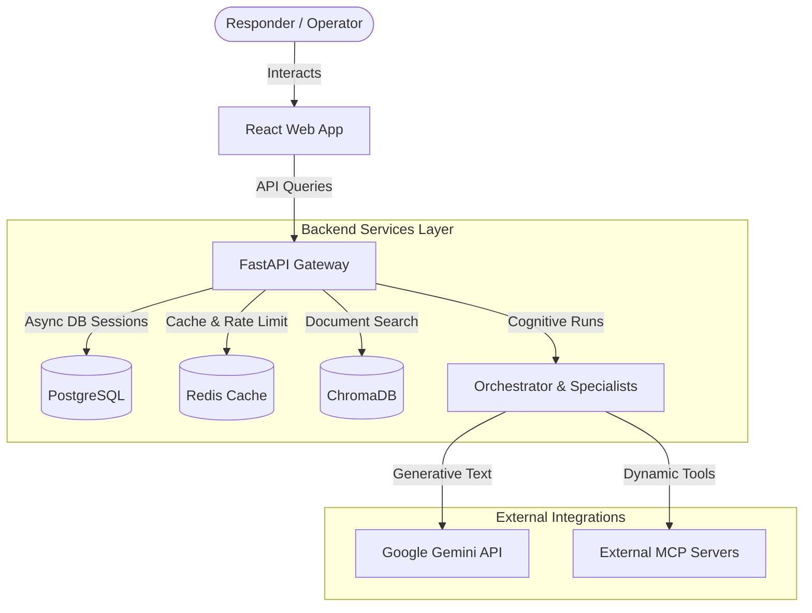
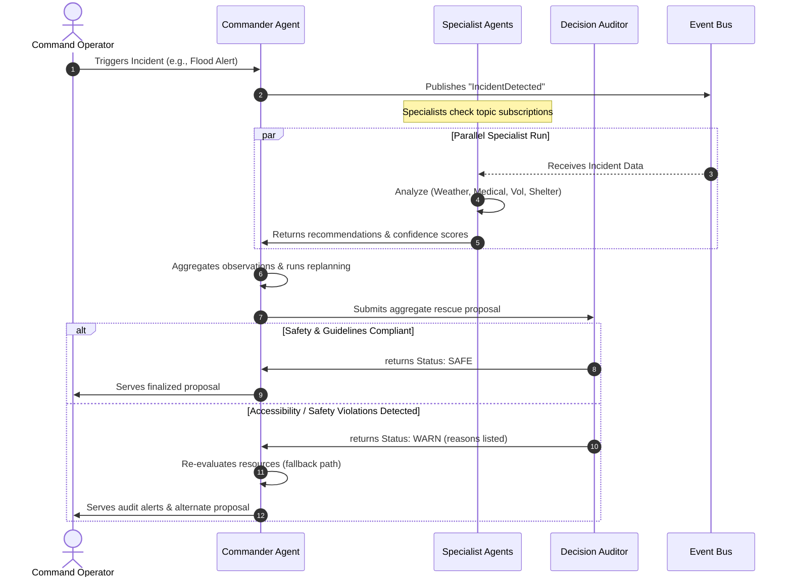
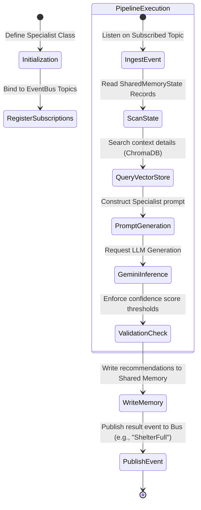
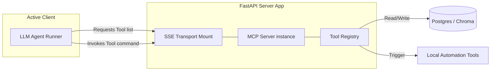

# HumanityOS System Architecture & Workflows

This document outlines the software architecture, agent hierarchies, cognitive interaction workflows, and Model Context Protocol (MCP) systems governing HumanityOS.

---

## 🏗️ Core Architecture Overview

HumanityOS is structured as a modular monorepo that separates cognitive orchestration, data caching, transactional memory, vector stores, and visual monitoring:

---

## 🤖 Cognitive Agent Hierarchy & Interaction Workflow

Cognitive orchestration is divided into a centralized orchestrator, specialized responder nodes, and a security audit check. The workflow runs through sequential gathering, parallel responder evaluations, and final compliance audits:

---

## 🛠️ ADK Model & Workflow Pipeline

The Agent Development Kit (ADK) guides how specialist agents declare models, register tasks, listen to the global event broker, and perform structured inference:

---

## 🔌 Model Context Protocol (MCP) Integration

The Model Context Protocol (MCP) enables LLMs to dynamically discover and call local or remote tools in a secure sandbox:

1. **SSE Transport Mount**: FastAPI mounts `/mcp` endpoints using Server-Sent Events (SSE) to facilitate streaming request-response loops.
2. **Tool Registry**: Declares active scripts and capabilities (e.g. check shelter occupancy, dispatch trucks) as JSON Schemas.
3. **Dynamic Invocation**: The client queries the schema list and invokes tools dynamically to resolve contextual gaps.
